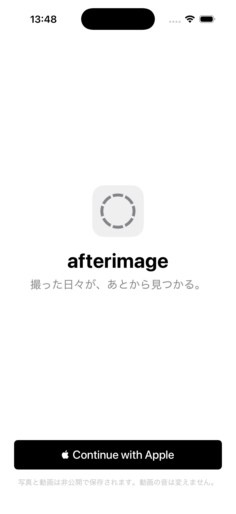
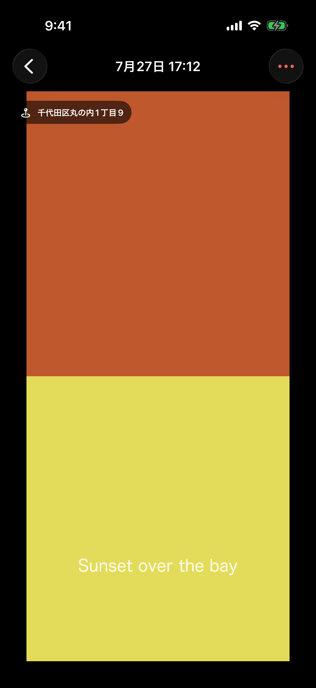

# Afterimage App

A privacy-first iOS lifelog that turns personal video into a searchable timeline.
The iOS app optimizes media on-device, the Cloudflare backend stores only the
optimized copy in private R2, and optional transcription, visual analysis, and
MCP access remain owner-scoped and consent-gated.

This repository contains the product app and hosted-backend implementation.
[`kandotrun/afterimage`](https://github.com/kandotrun/afterimage) is a separate,
self-hosted camera-ingest project.

## Screenshots

iPhone 17 Pro / iOS 26.5 Simulator using synthetic fixture data:

<p align="center">
  
  
  
</p>

## What is included

- **iOS 26 app:** SwiftUI, Liquid Glass, PhotosPicker, in-app capture,
  on-device HEVC optimization, background upload, private playback, search,
  Live Activity upload progress, and Sign in with Apple.
- **Cloudflare backend:** Hono on Workers, D1 metadata, private R2 media,
  short-lived playback/media grants, account deletion, and scheduled cleanup.
- **Optional AI processing:** Soniox transcription, Qwen daily summaries, and
  an outbound-only Mage-VL GPU worker.
- **MCP:** owner-issued, hashed tokens and per-video access controls for
  read-only agent access.

## Privacy model

- Original imports are never uploaded. A failed optimization does not fall back
  to sending the source file.
- Media objects, transcripts, analyses, grants, and queries are scoped to the
  authenticated owner.
- External AI is disabled until the user gives versioned consent. MCP access
  also requires per-video opt-in.
- Playback, worker, and agent media URLs are short-lived grants rather than
  permanent public URLs.
- Asset and account deletion include durable cleanup and retry paths.

The repository is public, but any deployed instance still handles highly
sensitive personal data. Review the threat model, provider terms, retention
policy, and legal requirements before operating it for other people.

## Repository layout

```text
backend/       Cloudflare Worker, D1 migrations, R2 and provider integrations
ios/           SwiftUI app and upload Live Activity extension
mage-worker/   Outbound-only Python Mage-VL lease worker
scripts/       CI, release, archive, and production rollout contracts
docs/          App Store material and design/implementation records
```

See [`AGENTS.md`](./AGENTS.md) and the nested `AGENTS.md` files for project
boundaries and verification rules.

## Prerequisites

- Node.js 24 or newer and npm
- Python 3.12 or newer for the Mage worker
- FFmpeg for local media fixtures and Mage processing
- Xcode 26 and XcodeGen for native iOS builds
- A Cloudflare account for deployment
- Apple Developer configuration for Sign in with Apple, WeatherKit, device
  signing, and App Store distribution

## Quick verification

The cross-platform repository checks do not replace a real Xcode build, but
they validate the backend and source/release contracts:

```bash
npm ci
npm run check
```

Run the Mage worker tests separately:

```bash
python3 -m venv /tmp/afterimage-mage-worker-venv
/tmp/afterimage-mage-worker-venv/bin/pip install -e 'mage-worker[test]'
/tmp/afterimage-mage-worker-venv/bin/pytest mage-worker/tests -q
```

For iOS, generate the project and run against an available iOS 26 simulator:

```bash
cd ios
xcodegen generate
xcrun simctl list devices available
xcodebuild test \
  -project afterimage.xcodeproj \
  -scheme afterimage \
  -destination 'platform=iOS Simulator,id=<SIMULATOR_UDID>' \
  -derivedDataPath DerivedData \
  CODE_SIGNING_ALLOWED=NO
```

The checked-in Xcode project contains the maintainer's bundle identifiers, signing
team, associated domain, export settings, and production API origin. For a fork,
replace those values before signing or distribution. During local DEBUG runs,
point the app at your local Worker with the scheme launch arguments:

```text
-afterimageApiBase http://127.0.0.1:8787
```

Do not upload personal media to an endpoint you do not operate. App Store builds
use the repository's configured HTTPS origin and do not honor this DEBUG-only
override.

## Local backend

The development config uses local D1 and R2 bindings:

```bash
cd backend
npm run dev
# In another terminal:
npm run seed:dev
```

The seed command creates synthetic media and prints a development-only bearer
session for the app's DEBUG launch arguments. Never use it against production.

For a separate Cloudflare environment, copy the placeholder config and fill in
your own IDs and resource names:

```bash
cd backend
cp wrangler.example.jsonc wrangler.jsonc
```

Keep `wrangler.jsonc`, `.dev.vars*`, `.env*`, private keys, provisioning
profiles, media, and generated deployment artifacts out of Git. Production
secrets include:

- `APPLE_PRIVATE_KEY`
- `SONIOX_API_KEY`
- `QWENCLOUD_TOKEN_PLAN_API_KEY`
- `MAGE_WORKER_TOKEN_HASH`

Non-secret provider URLs, model names, bundle IDs, and resource placeholders
live in the Wrangler configs. The production rollout script is intentionally
strict and maintenance-aware; read it fully before adapting it to another
environment.

## Mage-VL worker

The GPU worker opens no inbound port. It polls an authenticated lease endpoint,
downloads one consented video through a short-lived grant, processes it in a
per-job directory, and removes source and derivative files on every exit path.
See [`mage-worker/README.md`](mage-worker/README.md) for the container and
systemd setup. Model weights and NVIDIA images are not distributed by this
repository and remain subject to their upstream terms.

## Releases and CI

Native builds, screenshots, TestFlight delivery, and production deployment use
maintainer-controlled self-hosted runners and repository secrets. Workflows do
not run untrusted fork code on those runners. External contributors should
include local test results with their pull request; maintainers run trusted
native/release checks after review.

## Contributing and security

Read [`CONTRIBUTING.md`](CONTRIBUTING.md) before sending a change. Report
vulnerabilities privately as described in [`SECURITY.md`](SECURITY.md), and
never attach real lifelog media, credentials, account identifiers, or provider
payloads to a public issue.

## License

MIT. See [`LICENSE`](LICENSE). Third-party components and external model/runtime
artifacts retain their own licenses; see [`THIRD_PARTY_NOTICES.md`](THIRD_PARTY_NOTICES.md).
