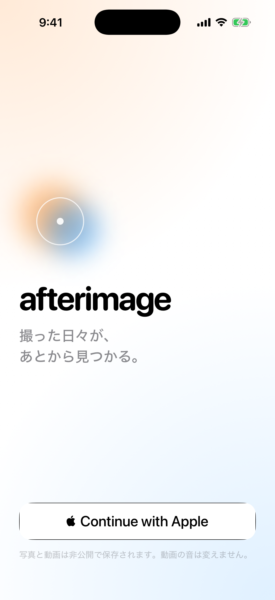

# Afterimage App

A private, iOS-first lifelog inspired by the effortless camera-roll experience of POOL. Import photos and videos, optimize them on-device, keep only optimized media in private Cloudflare R2, and browse a personal timeline. The product direction is searchable memory; transcription and semantic recall follow after the private media foundation.

> This repository is private product code. The existing `kandotrun/afterimage` repository remains the separate self-hosted/OSS project.

## Screenshot

iPhone 17 Pro / iOS 26 Simulator:

  

## Stack

- iOS 26 only, SwiftUI, Liquid Glass, PhotosPicker, AuthenticationServices, AVKit, Core Haptics
- On-device optimization before upload: HEVC video + bitstream-passthrough audio in MOV; HEIC photos. R2 never receives the original file.
- Cloudflare Workers + Hono
- D1 for users, sessions, asset metadata, and multipart state
- Private R2 for optimized media and thumbnails

See [`AGENTS.md`](./AGENTS.md) for security and TDD rules.

## Status

The initial vertical slice is deployed and covers:

1. Sign in with Apple
2. Photo/video import without loading large movies into memory
3. Authenticated single and multipart R2 upload
4. Private timeline and Range-capable playback
5. macOS CI build/test for the native app
6. Privacy manifest for linked account data and private photos/videos

The production Worker currently runs at `https://afterimage-api.softbank.workers.dev` with APAC D1 (`afterimage-prod`) and private APAC R2 (`afterimage-media-prod`). Deployment-local Cloudflare IDs live only in ignored `backend/wrangler.jsonc`.

## Deletion and cleanup invariant

Asset deletion immediately blocks authenticated access and deletes the current R2 keys plus the whole per-asset prefix. The D1 row remains as a hidden, terminal `failed` tombstone for 24 hours; scheduled cleanup then repeats prefix deletion before removing the row. This grace pass is intentional: it catches a media write that was already in flight when the first deletion completed.

Abandoned uploads use the same two-stage policy: stale `uploading` rows become `failed`, and only a later cleanup pass removes their R2 prefix and D1 metadata.

## Before TestFlight

The vertical slice is not yet an App Store release candidate. Complete these release blockers first:

- Bind every Sign in with Apple request to a unique nonce, verify it server-side, and reject nonce replay.
- Add in-app account deletion that removes D1 metadata, active multipart uploads, and all owned R2 objects.
- Configure the Apple Developer team, signing, App Store privacy answers, and a public privacy policy/support URL.
- Validate HEVC output and byte-for-byte audio passthrough on physical devices across representative AAC/ALAC input files, interruptions, low-storage conditions, and backgrounding.

Copy `backend/wrangler.example.jsonc` when provisioning another environment.
